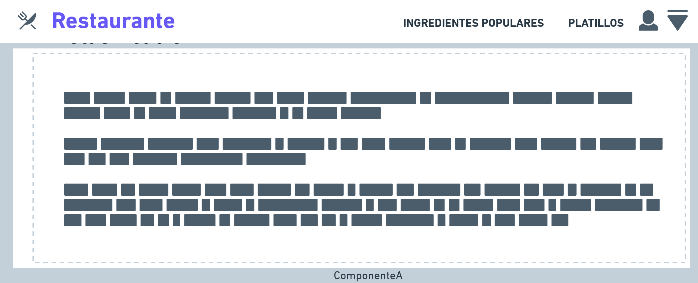
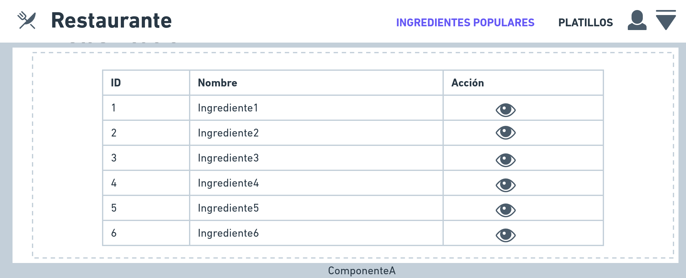
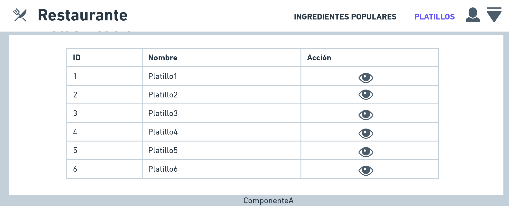
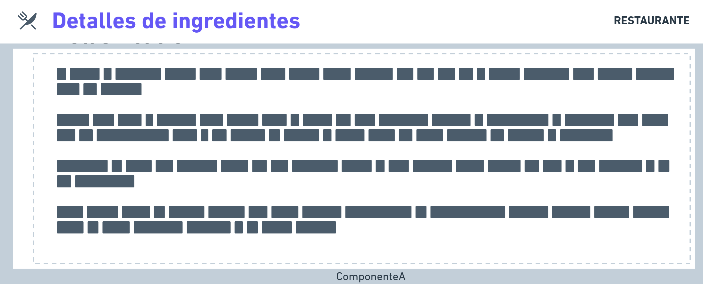
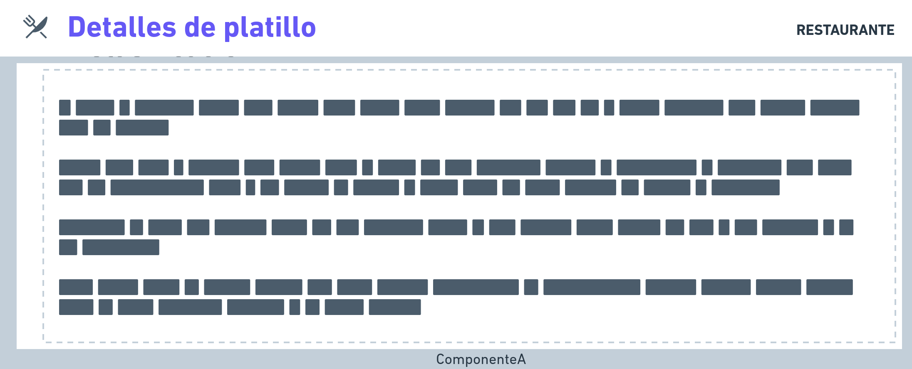

> # Restaurante - Angular 13 - Corus 
>   ## Commands
>   [List of commands](commands.md)

>   ## Demo 
>   [Working Demo](https://drowlex.github.io/restaurant/)
>   ## Mockups
>   ### Login
>   
>   ### Dashboard
>   
>   ### Ingredientes
>   
>   ### Platillos
>   
>   ### Detalle Ingrediente
>   
>   ### Detalle Platillo
>   
>   ## Test developer 
>       * npm run start:dev
>   ## Compile 
>       * npm run build
>   ## Deployement with github pages 
>       * npm run deploy
>   ## Extras 
>   * [Deploy app in github pages](https://www.youtube.com/watch?v=wL8gCda3pG4)
>   * [Deploy app of angular in github pages](https://dev.to/gedgonz/haciendo-deploy-de-una-app-en-angular-a-githubpages-4bll)
>   ## Developers 👨‍💻🔥 
>   * **Luis Ortiz @Drowlex** - *Development and Documentation* - [Drowlex](https://github.com/Drowlex)
>
>   🎉👨‍💻 _¡Sin miedo al éxito!_ 👨‍💻🎉    